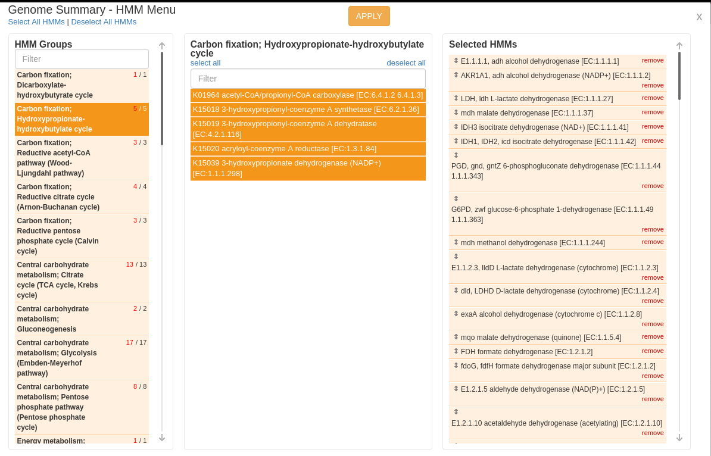
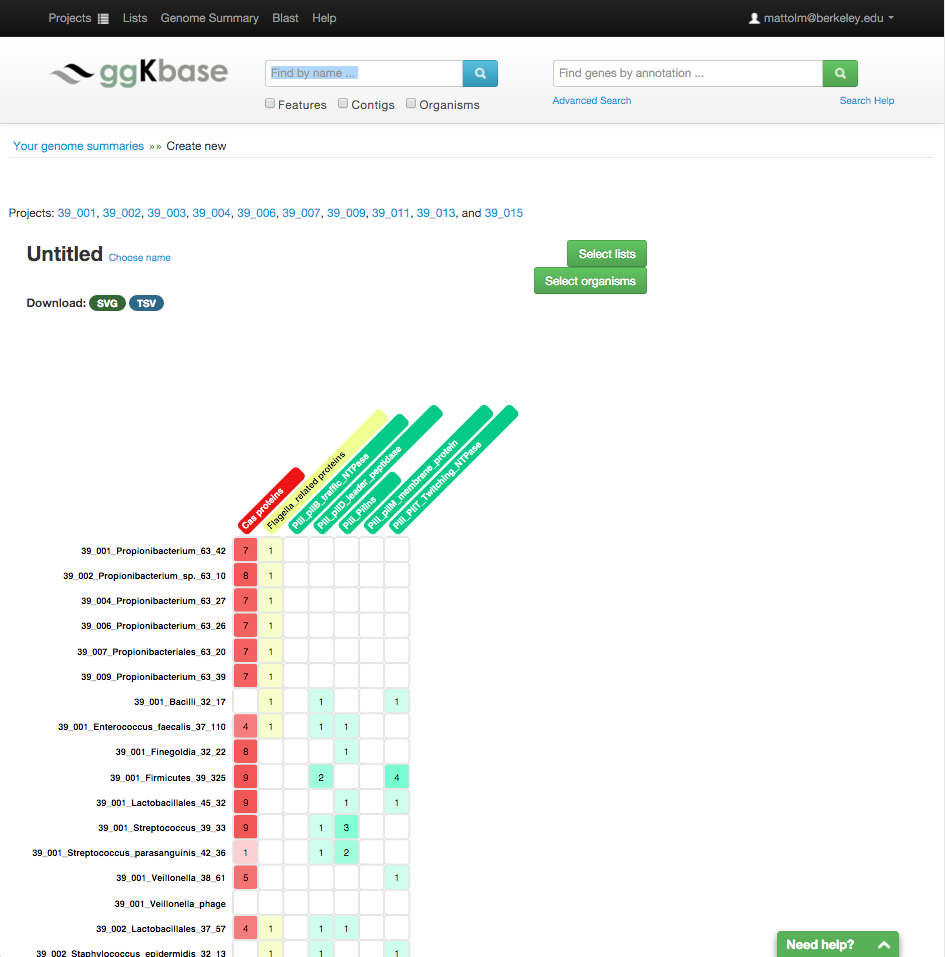
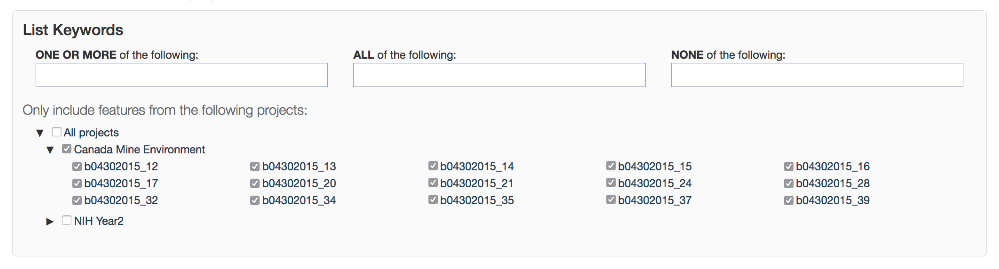
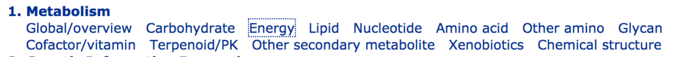

# Welcome to week 10 of Metagenomics Data Analysis Lab!

This week we're going to be investigating the metabolic capacities of the organisms in your samples. This is a great chance to get to know your bacteria (and viruses) a little better!

The main way we're going to be looking at this information this week is by using 'genome summaries', which are a tool included in the ggkbase platform.

Genome summaries are an important part of the ggkbase platform that allow users to interrogate the metabolic potential of the bins they’ve created. To make a genome summary, first click on Genome Summary at the top of the page, then click Create Genome Summary.

At this point you are able to restrict genome summaries to certain projects. For the purposes of this assignment, select all projects you have access to and click "Go to  Genome Summary".

You are now at your new, blank, genome summary. Now, click Select organisms. You can now choose the organisms that you would like to include in this figure. Again, for the purposes of this assignment, click Select All Organisms in the top left of the popup window, and then Apply.

First, we've recently added a new system that uses HMMs to detect genes, but it's not been run on this dataset, so we'll need to stop it from displaying. Click "Select HMMs" (right-most green button), then at the top left click "Deselect all HMMs", then "Apply". Now we can start from scratch.

Now click "Select lists". A screen now pops up showing you all of the “universal lists” which are available to all members of ggkbase. They’re grouped first by category, and then by smaller groups within each category. Pick some lists which interest you- some especially interesting lists are Immune system > Cas proteins, and Motility > select all. Once you’ve chosen your lists, click Apply at the top of the page.

You should now see something like this:

This is your genome summary! It shows each organism you selected as rows, and the number of proteins in each organism that match the search terms in each list. So in the screen-shot above, I see that these Propionibacterium bins have about 7 Cas proteins each, making it highly likely that they all have functional CRISPR arrays.

To save this summary you made, simply give it a name by clicking on Choose name (by “Untitled”). Now you can leave the page, and get back to this summary by clicking Genome Summary at the top of ggkbase again.

To investigate the proteins in each category, you can click on the numbers within the boxes. This will show the list of features which hit this list. From this list, you can find out which scaffold they’re on, they’re location, the sequence (for BLAST searches), the annotations, and more!

## What lists are for

Genome summaries and lists are intended to make it easier to visualize metabolic capacities across a large number of organisms and to share these visualizations with other researchers. You can make custom lists, as you'll learn about shortly, and can create genome summaries for various groups of genomes, making this a wonderful tool not only for extracting insights from your data but also to convey these insights to others.

## Using Custom ggKbase Lists

We just used universal lists in our genome summary.  Lists work by using key terms. ggKbase searches these terms against all of the annotations in all called proteins in all selected projects. As shown in the List Keywords section, there is some ability to refine you lists to your liking using these keywords.

There is a fantastic help page set up to introduce you to lists on ggkbase, and give you some tips and tricks: <a href=http://ggkbase-help.berkeley.edu/analysis/lists/>http://ggkbase-help.berkeley.edu/analysis/lists/</a>

To make your own list, click on Lists at the top of the page. Next, click Create a new list on the top right of the page. From here you can fill in all of the details to make your own list.  You can give it a name, color, and description.  The most important part of the list are the terms you select to include and exclude.  (This will be covered in the video for today's lab in more detail- go watch that!)

The three search boxes use boolean logic. The first box produces genes that have annotations matching one or more of the keywords (boolean OR). The second search box requires the genes annotation to match all the keywords (boolean AND). The last search box allows you to enter undesired keywords, excluding genes that have these keywords in their annotations (boolean NOT).

Let's try, as an example, making a list that just looks at Rubisco, the protein that fixes CO2 in the Calvin cycle. There's CO2 fixation going on in the human gut, too! 

 - Go to "Lists" at the top of the page, title your list, give it a description and a color.
 
 - Scroll to the bottom, and you'll see the "List Keywords" menu. Type "Ribulose" and you'll see a bunch of options pop up; select "Ribulose-1,5-bisphosphate carboxylase" and then press the "Save list" button.
 
Now you'll see a bunch of information on the next page. On the left-hand side of the page is a box that says "Projects"... next to that, click "Select all", then on the right of the page click the big blue button that says "Update". Now you're looking at all the projects you have access to, and you should see all the Rubisco proteins in that set!

Now, there's one more thing to do. Rubisco is comprised of a large and a small subunit- for now, let's just look at the large subunit. In the search bar that says "**Exclude** these terms", type "small". Now your results are just for the large subunit of Rubisco! 

You can download a FASTA file (either DNA or protein) with all of these results by clicking "Download list" (near the top of the page) and selecting the type of FASTA you'd like to download. Feel free to do that with the Rubisco results to test it out. 

You're going to be using SCP to move things from your computer onto the cluster, so if you don't remember how to do that, A. talk to me and I'll help you, and B. write it down somewhere!

## Investigating Metabolic Pathways

Go to the KEGG pathways page (this was in lab 9... remember?)

<a href=http://www.genome.jp/kegg/pathway.html>http://www.genome.jp/kegg/pathway.html</a>

You’ll see a number of links to different types of metabolic categories:

You can pick any metabolism you are interested in for this lab.  As an example, click on Energy and then "Carbon Fixation Pathways in Prokaryotes".  Let’s say you are particularly interested in CO2 fixation in the gut.

You can see all sorts of different reactions and compounds now- roll over any of them with your mouse to get a little extra information. Click on particular compounds if you'd like to see their structure, and click on reactions to see the product/reactant compounds as well as all the genes KEGG has identified which participate in that reaction (there may be many!).

Now let's go back to your genome summary on ggkbase.

Click "Select lists", then navigate to "CO2 fixation" (if you can't find it, type it in to the search bar on the left). In the middle bar, right under the words "CO2 fixation", there's a blue button that says "select all". Click that, then click "Apply". 

Now you can see the genes predicted to be involved in CO2 fixation pathways across all your selected genomes! This includes the Rubisco genes we were investigating earlier.

## Comparing to Public Databases and Making a Phylogeny

Now that you have an idea about the distribution of a metabolic function across your genomes, you can compare one of the key genes in your pathway to publically available homologs of that gene. The point of doing so is to be more confident in whether or not it is the enzyme the annotation says it is. Gene-level annotation can be a messy process, and it's always good to check things you're particularly interested in.

Look around for a particular gene you're interested in using the ggKbase lists, then make a custom list (as described above under "Using Custom ggKbase Lists") and download the resulting FASTA. Try and make sure you only have one gene in this list! Read through the annotations and make sure. (Again, i'll go over an example of how to do this in the lecture video.)

Now, throw that file up on the cluster using SCP. Remember, you're transferring a file from your computer to the cluster, so your command should be in the format `scp filename studentid@class.ggkbase.berkeley.edu:~/destination_for_your_file`. Remember to include your own student ID and file destination (don't copy paste that command).

Once that file is up in your home directory on the cluster, we're going to make an alignment out of it:

`mafft --reorder --thread 4 [INPUT FILENAME] > [OUTPUT FILENAME]`

ex.:

`mafft --reorder --thread 4 rubisco_largechain_hits.faa > rubisco_largechain_ALN.mfaa`

Remember that these file extensions are not necessary, I just include them to be explicit about what kind of data the file contains.

Now that we have an alignment, let's make a quick tree out of it!

`fasttree [YOUR ALIGNMENT] > [OUTPUT TREEFILE NAME]`

ex.:

`fasttree rubisco_largechain_ALN.mfaa > rubisco_largechain.treefile`

Then upload that file to iTOL. Detailed instructions on how to do this are in lab Remember, there are two ways to do that: 
- you can download the treefile using `scp` onto your PC then upload that file to iTOL via your browser;
- or you can copy paste the text of the treefile. On your terminal connected to class.ggkbase.berkeley.edu, type `cat [YOUR TREEFILE]`, then copy the text that shows up! 

(Again, there will be an example in the lecture video for this week on how to do this.)

What do you see? Are the proteins organized mostly by phylogeny? (e.g. is a group dominated by Enterococcus or Bacteroidetes?) Is there a branch that's anomalously large in your phylogeny, potentially indicating that more than one type of gene is present?

Now remember, you can get more closely related proteins from NCBI BLAST, but that's a little tricky so I'm going to go over that only in the lecture video.

That's all for this week! Congrats on making it through!

