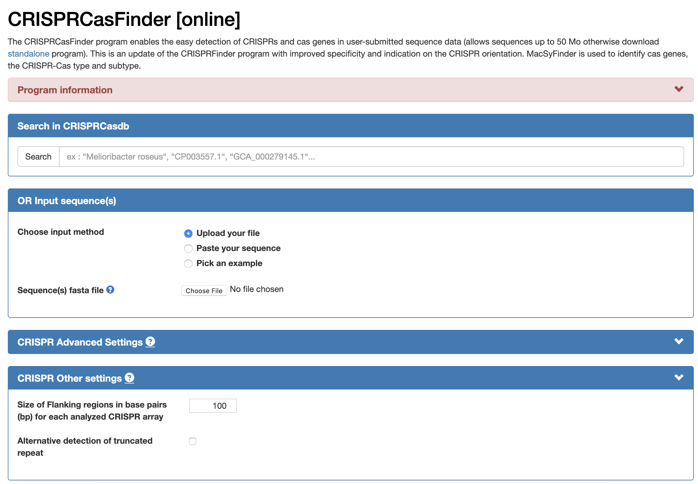
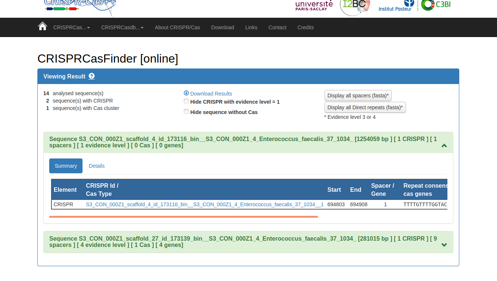

# Welcome to week 11 of Metagenomics Data Analysis lab!

This week we're going to be looking into methods of identifying CRISPR systems and arrays, as well as identifying phages and other types of mobile genetic elements in your microbial genomes.

The first order of business is to reduce the number of genomes we'll be looking at. Go to class.ggKbase.berkeley.edu and, just like last week, make a genome summary. Select all available projects and organisms.

This time we're going to be looking for CRISPR systems, so we have a couple of options for lists to use:

  - There's a pre-made list of Cas proteins (under the category 'Immune System -> Cas Proteins'). Go ahead and select that.
  
  - You can make a custom list that searches gene-level annotations for the word 'CRISPR'. You'll find, if you use both of these lists, that they line up quite nicely, since most (if not all) results for CRISPR will be Cas proteins (since Cas stands for CRISPR-ASsociated protein).
  
Go ahead and look through all the genomes available to you, and find a genome that strikes your fancy. Remember, you can hover over the colored squares to see the number of hits in that genome. You'll be looking through that genome today for CRISPR systems.

Double click on the name of that organism to go to its ggKbase page, and select 'Download -> Contigs (fasta)' to download these contigs to your computer. 

Next, we're going to use CRISPRCasFinder online to find CRISPR systems in your genome of choice. <a href=https://crisprcas.i2bc.paris-saclay.fr/CrisprCasFinder/Index>https://crisprcas.i2bc.paris-saclay.fr/CrisprCasFinder/Index</a>

Go ahead and upload your file, as shown below.

You should have a little green box for each potential CRISPR Cas system. Click on it to expand it, and click on the details tab (or just click on the name of the query sequence, which should be a hyperlink).

You can now search these spacers in the CRISPRCasFinder database. Once you're in the 'Details' tab, check all the boxes on the right-hand side (these are your spacers, which form the guide RNA that targets viral invaders) and select "search spacers in database". Do you see any hits to related organisms? What about organisms that are totally unrelated? See anything unexpected?

---

# Finding Phages

Next, we're going to look through your data for some bacteriophages! Some of you have been lucky enough to find a couple good candidate phage genomes already, but let's look for some more anyway. There are certainly more yet to be found.

There are two options for how to approach this: You can use a custom list (use search terms like "phage", "terminase", "capsid", etc.), or you can just look through annotations of your bins. 

Luckily for you, Jill has written out some tips on how to look for phages in ggkbase annotations, and what types of features usually distinguish them from everything else. Without further ado:

## Jill's tips for phage prospecting

There are several ways to start the process of identifying a phage sequence. It helps to know what features of scaffolds are typical of phages.

Although there are exceptions (mostly for phages of very well studied human microbiome bacteria), most phages do not look like genome fragments from microbes. Some possible indicating features are:

- Dominance by hypothetical proteins (true of essentially all phages)

- The majority of proteins have no best hit recorded ("unknown" under gene name in contig view). Thus, no phylogenetic profile is given under "contig" in the UNK bin listing (i.e., "unknown" Domain in the binning tools).

- Best hits are to other phage proteins- note many have annotations that start with 'GP', such as Gp5, Gp7, etc. This naming convention is because they were originally found and incorporated into a database which named them this way- don't worry about what "GP" means.

- Presence of genes encoding phage structural proteins (e.g. terminase, portal, capsid, tapemeasure protein)

- Smaller phage may mostly have ORFs coded on only one strand. Remember, you can check which strand an ORF is on by looking at the coordinates of the gene on ggKbase (ask Jacob for help if you don't know how to do this). 3'-5' strand is default-  if it says comp(), it's on the complementary (5'-3') strand.

- Generally more ORFs per kbp of DNA sequence (due to viral ORFs being smaller)

- Annotated genes that are not phage/structural genes often involved in nucleotide metabolism, including DNA polymerase, nuclease, helicase, integrase, etc.

- It is possible, but not necessarily true, that the contig/scaffold will circularize. (Jacob's aside: You guys don't need to worry about this, although if you want to learn how to circularize scaffolds, ask us! We're happy to teach you. It's a little involved so it's not part of the default course material)

To distinguish a plasmid from a phage, look for plasmid genes, e.g. conjugation related (Tra, Trb, Mob), RepA, partition (e.g. parC), and other replication proteins, as well as Type IV secretion systems (necessary for conjugation).

---

## Searching for phage with lists

If you want to start the search for phage using phage structural proteins, you can make a custom list in ggKbase. It will be hard to confidently classify most short sequences. 

It is quite possible that you will identify prophages (phage DNA integrated into the host genome). These can be identified if your genome fragment is long enough to transition into well annotated bacterial genome sequence; look for integrases as an indicator that this might be happening.

---

# Looking at the phages that you've found

Hopefully that's sufficient for you guys to find at least one phage, hopefully more. Go ahead and save these, as you might want to use them in your projects later on down the line! Save them, either on your computer or on the cluster.

Go ahead and throw the viral contig onto BLASTn. Has this phage been seen before? If so, has the host been determined?

Is there evidence that this is a prophage?

What types of functions are present?

---

Keep this data- many of you will likely choose to use these viruses as part of your projects, and it will be very valuable.

You're done for this week! Congrats!

