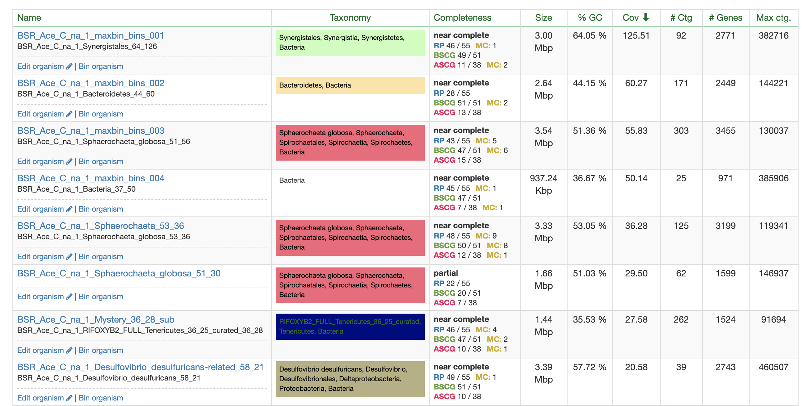
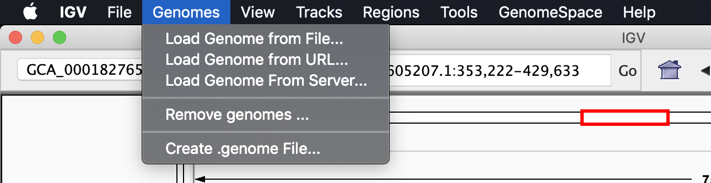
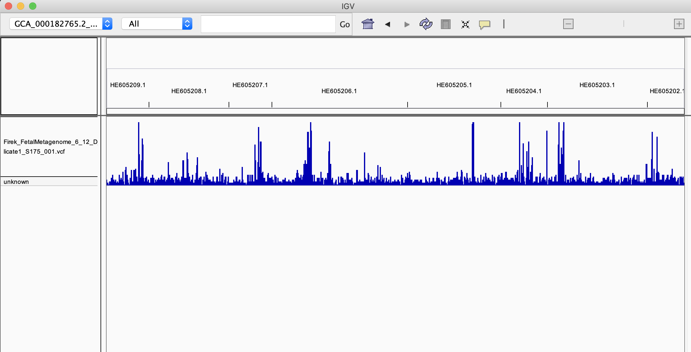
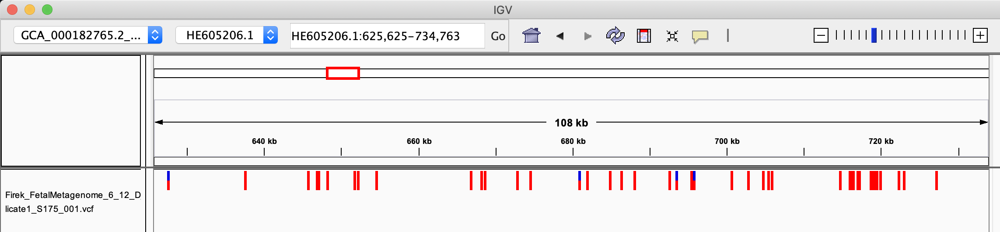
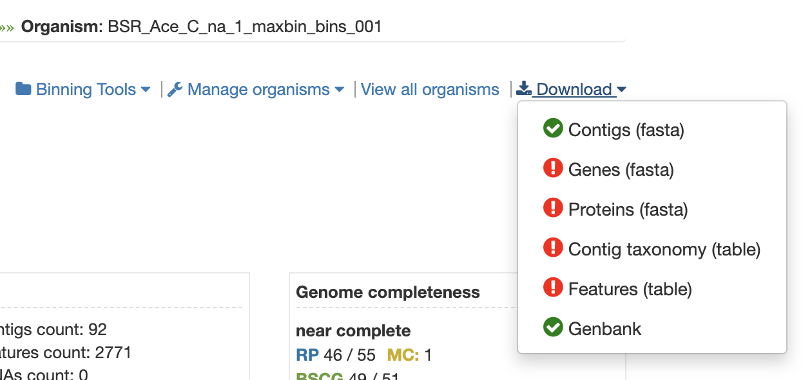

# Hi all, and welcome to week 12 of metagenomics data analysis lab!

In this exercise you’ll be generating a VCF file, which is a file that contains information about all of the variants or single nucleotide polymorphisms (SNPs) in your bin.

IMPORTANT: To save time (and because of limited computational resources), only generate one VCF file per group in class this week. 

### Select a genome
We are going to be digging a bit deeper into the population variation in one of our bins and it will be helpful to use a high quality bin for this purpose. These are all located on the cluster at `/class_data/baby_bins`, but we're going to go to class.ggkbase.berkeley.edu on your browser to choose a bin to work with. Try to pick a bin that is marked as “near complete” with close to 51/51 bacterial single copy genes. Also try to pick a bin with relatively large scaffolds and between 30-100x coverage. The max contig column of the ggkbase organisms page can help you locate a good bin, which ideally will have a small number of large contigs. A bin with a max contig around 200,000 bp or greater would be a good choice. 

## Read mapping

Read Mapping

You will need to use the trimmed sequencing reads for the mapping. Trimmed sets for each sample are located here:

`/class_data/S3_0XY_000X1/raw.d/`

Remember to replace 'XY' with your sample number, ex.: `S3_002_000X1` or `S3_010_000X1`.

To call variants with freebayes, first we have to map our reads to our bin and generate a SAM file.  To do this we’ll use bowtie2, a read alignment algorithm.  Bowtie2 generates a lot of files in the directory it is run in, so it is useful to make a directory for all of the outputs for each genome you are mapping to and run it in that directory.  Important: map reads from the sample the bin you picked is from.

On apatite (the server accessed through terminal, not ggKbase website), within your home directory make a lab13 directory and inside of this make a ‘bt2’ directory.

Bowtie2 first needs to build index files for the genome you are mapping to.  The command to do this is bowtie2-build.  It takes a DNA fasta file and the “stem” name of that file (the generated files are named using this “stem” and it is used later to tell bowtie2 what files to use).  An example is shown below, replace the fasta file and stem with your own.  

Now we can run bowtie2 and generate the SAM file.  The alignment will most likely take a while (~15-30 min, depending on how big your genome bin file is and how many reads align to it), so make sure to run it from a tmux session! (I'll show you how to do that in the lecture video.)

To run bowtie2:
    1. Run bowtie2 with the following arguments 
        a. –x : the stem of your index files built with bowtie2-build
        b. -1 : the fastq file for the original forward reads for your metagenome sample
        c. -2 : the fastq file for the original reverse reads for your metagenome sample
        d. -p 6 : the number of threads bowtie will use. The 6 specifies 6 threads. This option will make bowtie run faster but also use more computational resources. Please do not use more than 6
        e. the output of bowtie2 (aka “standard output” or stdout and the standard error or stderr) must be redirected to a file.  This is done with a special redirect ‘2>’.  More on this here http://mywiki.wooledge.org/BashFAQ/055
        f. Redirect this output to the final SAM file 
        
After that, we want to make sure that we don't leave a .sam file lying around (because it's enormous), so we use a program called `sambam` (really just a wrapper for a couple other commands) to do a couple other processing steps.

Here's an example command- remember to `cd` to your `~/lab12/bt2` directory (or whatever you called it) and ensure that your bowtie2 index has been built before doing this:

`bowtie2 -x [YOUR INDEX NAME] -1 /class_data/S3_002_000X1/raw.d/S3_002_000X1.R1.fastq.gz -2 /class_data/S3_002_000X1/raw.d/S3_002_000X1.R2.fastq.gz -p 6 2> mapped.log | sambam > [YOUR GENOME BIN NAME].sorted.bam`

I'll be blunt: SAM files are a pain in the butt. They're absolutely enormous- they're records of how well each read matches to each position in your index (in this case, your genome bin).

They're so big that, as standard practice, we eliminate them basically immediately and turn them into binarized versions (BAM files). In this case, we don't even write the SAM file to disk at all.

# Calling variants with Freebayes

Calling variants with freebayes 

Running freebayes is fairly straightforward. We only need to provide our bin contigs as a –fasta-reference as well as our fully processed BAM file. However, we also want to filter our variants and only look at high quality calls. To do this, we will pipe our freebayes output with ‘|’ into vcfqualfilter, a script provided by freebayes that can filter variants based on a quality score. See the example below:
	
`/home/jwestrob/bin/freebayes-v1.3.0-1 --fasta-reference [YOUR GENOME BIN] [YOUR GENOME BIN].rmdup.bam | /home/jwestrob/bin/vcflib/scripts/vcfqualfilter --cutoff 20 > [YOUR GENOME BIN].rmdup.bam.vcf`

The resulting VCF file contains your variant calls.

# Visualizing variants with IGV

We’ve now called variants and can get a good idea of where there’s variation in our population! The only problem is its most likely a lot of data and difficult to interpret. To help, we will be visualizing our variants with Integrative Genomics Viewer (IGV).

IGV can be downloaded here: https://software.broadinstitute.org/software/igv/download

Once installed, the first thing we have to do is load our bin as the current genome. To do this, first download your bin's contigs. Then, in the ‘Genomes’ tab of IGV, click ‘Load genome from file’ and select your bin's contigs.

Next, download your VCF file and load it into IGV by clicking ‘File -> Load from file’. Your IGV should at this point look something like this:

The top bar you may recognize as your contigs, represented as a genome. Below is your VCF file represented as a ‘track’ along the genome. At the fully zoomed out level, the height of the bars represent the number of variants within that region of your bin. So a tall bar means lots of variants. If you zoom into one of these locations, you can see each individual variant and mouse over them for details.

Next were going to load our BAM file so we can see how the read mapping information resulted in each variant call. However, we need to make a BAM index to be able to view it with IGV. We will use picard, a popular script developed by the Broad Institute for working with variant-level genomic data.

`java -XX:ParallelGCThreads=6 -jar /home/jwestrob/bin/picard.jar BuildBamIndex I=[YOUR BAM ALIGNMENT].bam`

Download the index file and your bam file. Open your bam file in IGV by clicking ‘File -> Load from file’ and you should now have a read coverage track as well where if you zoom in, you can see each individual read mapped to your bin. 

Lastly, lets load our annotations into IGV so we can see where variants overlap with proteins. All this requires is to download a genbank file from ggkbase for our bin and to load it in IGV with ‘File -> Load from file’

Take a look at some of the regions with a lot of variants, are they concentrated in a specific protein? 

What might a lot of variation in a particular protein be indicative of?

Congratulations on getting through this little introduction to visualizing variants. There are lots of other tools to use to look at this type of information, this is just a way of showing A. how to generate that information and B. some of the tools used to process and visualize it. There's a lot you can do with this, and lots of different fields of research where this is a particularly useful skill.
