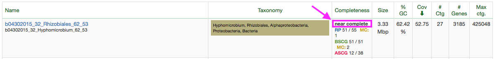

# Hello and welcome to the last lab of the year!

Today we're going to be using a tool called iRep (https://www.nature.com/articles/nbt.3704), which allows for the measurement of growth rates in microbial communities using metagenomic data.

Here's the github page for iRep: https://github.com/christophertbrown/iRep

## Delete old .bam files

Before we do anything, make sure you delete the .bam files you generated last week. They're huge, and there's no need to keep them around unless you intend to use them 

Let's jump right in!

## Selecting a genome 

We want to measure the growth rate for individual genomes, since doing more than one is a highly computationally intensive task and too much for one lab.

You can use any genome from any project, but if we want to compare our results it may be best to select one of the genomes from one of your group’s projects.  By ‘draft quality’ something that is marked as “near complete” with close to 51/51 bacterial single copy genes (BGCS) and few multiple copies (MCs) like the example below.  The actual requirements for iRep are that the genome must be >75% complete (one estimate is >38 BSCG (51*0.75) and <2 MCs, this can also be measured using checkM), <175 fragments/Mbp, and >5x coverage).  



All of these are already on the cluster at `/class_data/baby_bins/`. Find the file there that corresponds to the bin you've chosen, then copy it over to your home directory.

Let's make a directory in your home folder that we'll work in today- call it `~/Lab13`. (Remember `~` means your home directory!) Move that bin file into this folder.

We're going to be mapping reads back to this genome just like we did last week, but this time we have to actually make a .sam file, since that's what iRep wants as input. So make a folder `~/Lab13/bt2`, copy (or move, or symlink) your genome file into that directory, then build your bowtie2 index with:

```bowtie2-build [NAME OF YOUR GENOME FILE] [NAME OF YOUR INDEX]```

## Mapping your reads

Refer back to the lab 12 walkthrough (<a href=https://github.com/jwestrob/ESPM_112L/blob/master/Week_12/Week_12_Walkthrough.md>link here for your convenience</a>) for how to find reads, set up the mapping job, etc. 

There is a slight difference between what we're doing this week and what we did last week. We're not going to be converting directly to a `bam` file, we're going to be writing to a `sam` file. Follow the procedure for Lab 12 just as it's written, but modify the command like so:

```bowtie2 -x [YOUR INDEX NAME] -1 /class_data/S3_002_000X1/raw.d/S3_002_000X1.R1.fastq.gz -2 /class_data/S3_002_000X1/raw.d/S3_002_000X1.R2.fastq.gz -p 6 --reorder 2> mapped.log > [YOUR GENOME'S NAME].sam```


## Running iRep

iRep is really straightforward to run once you've got your FASTA contigs and your SAM file. 

iRep is loaded on the cluster, so just type `iRep -h` to see the help menu and view all  the different options.

Here's a breakdown of the options:

	- f is the input fasta file (in this case for your genome bin)
	- s is the ordered SAM you just generated
	- o is the base name for the output files (the name you’d like the output files to have, like the base name in your bowtie2 commands)

and here's an example command:

```iRep -f [YOUR GENOME BIN] -s [YOUR ORDERED SAM FILE] -o [OUTPUT FILE BASENAME]```

running iRep is really straightforward, and gives you two output files: a .pdf and a .tsv file. 

