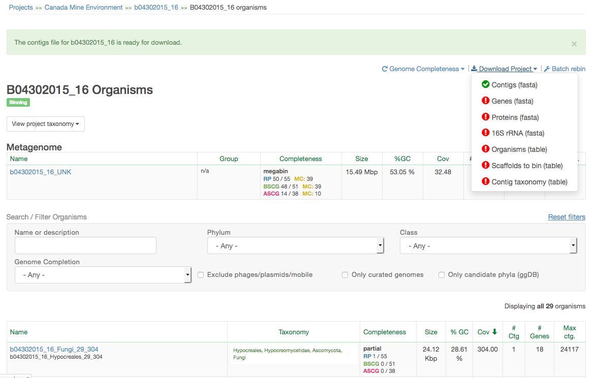

# Welcome to week 5 of lab! 

### This week we're going to be refining our bins and doing some additional binning using ESOMs (Emergent Self-Organizing Maps).

### This is a really interesting way of visualizing the way automated algorithms interpret and sort metagenomic data. Next week we'll be using automated binners, which utilize other unsupervised machine learning algorithms. (Not ESOMs, though. We'll talk more about the other popular methods next week.)

This lab is going to be pretty short from your perspective, but know that there was a lot of preparation that went into this week's material! I hope it's enjoyable for you.

---

# Section 1: X11 Forwarding

You're going to be doing this week's lab using a GUI process, which requires some special considerations. GUI stands for **G**raphical **U**ser **I**nterface. You might be thinking, "aren't we doing all our work in a shell?" Well, yes, we are. This week we're going to set things up so that you can run a GUI process on our server while having a window on your computer to modify and mess with as you see fit. X11 forwarding is what you're going to need to use in order to accomplish this.

How to set up X11 forwarding depends entirely on which operating system you're using. In our class, we have four options, which I will order from least to most complicated:

- Linux-based operating systems (NOT CHROMEBOOKS):
    - in your terminal, type `ssh -X [YOUR USERNAME]@class.ggkbase.berkeley.edu`. You're done.
    
- Mac OS X:
    - For whatever reason, X11 forwarding is disabled by default on macs. Don't ask me why. In order to get around this, you have to go and download XQuartz (https://www.xquartz.org/).
    - Go and download XQuartz-2.7.11.dmg, open it, and open the .pkg file you'll find therein. This will install XQuartz on your system.
    - Now log in and log out of your current session. (Go to the top right, click on your username, and click 'login/switch user' or whatever it says.)
    - Now, go to your terminal, type `ssh -X [YOUR USERNAME]@class.ggkbase.berkeley.edu`. Now you're done.
    
    
- Windows:
    - Download and install xming: https://sourceforge.net/projects/xming/
    - Edit Putty preferences:
    
    - Launch your connection as normal. Congratulations.

- Chromebook:
    - Use one of the windows PCs in lab. Sorry.
    - If you really are determined to figure out how to do it, look here: https://superuser.com/questions/1037230/is-there-a-way-to-use-xterm-on-chromebook
    
    
---

# Section 2: Preparing files for ESOMs

Now, I've actually run the ESOMs already. (They take a really long time- best to do that before class.) What you're going to be doing next is to get a file from <a href=class.ggkbase.berkeley.edu>class.ggkbase.berkeley.edu</a> (in your browser, not on the terminal) that indicates which scaffolds correspond to each bin. 

Only one person per group will need to do this.

Go to class.ggkbase.berkeley.edu, log in, and navigate to the project folder for your baby. You'll be downloading a 'scaffold2bin' file, which has information for each of the scaffolds in your project and their corresponding bin ID. Download it from this drop-down menu:

