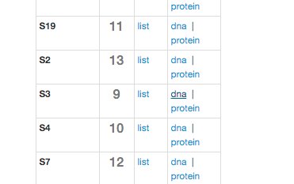

# Welcome to week 7 of metagenomics lab!

This week we're going to be going over some material that's very near and dear to my heart... phylogenetics!

A lot of microbial ecology research revolves around phylogenetic analysis, especially my own. So what is it, exactly?

Phylogenetics is basically the process by which we estimate relationships between organisms. In the case of today's lab, we'll be using it to measure the relationships between bacteria in your baby gut samples.

### What's required to perform phylogenetic analysis?
    - A sequence set (DNA or protein)
    - A multiple sequence alignment program
    - An alignment (made by using the two previously mentioned items)
    - Phylogenetic tree estimation software (FastTree, iQ-TREE, RAxML, etc)
    - Phylogenetic tree visualization software (iTOL, FigTree, etc)
    
### What software will we be using to get this info?
    - Sequence set: ggKbase
    - Multiple sequence alignment: Mafft and FAMSA (both on the cluster)
      - Mafft: https://mafft.cbrc.jp/alignment/software/
      - FAMSA: https://github.com/refresh-bio/FAMSA (Wicked fast!)
    - Alignment viewer: Aliview (https://ormbunkar.se/aliview/)
    - Tree building: FastTree (on cluster)
    - Tree visualization: iTOL (http://itol.embl.de)
    
       
---

# Section 0: Uploading your refined DASTool bins from last week and renaming your bins by taxonomy

Download your `scaffolds_to_bin.txt` file from DASTool that you generated last week and upload it to ggKbase. Sorry this wasn't working last week - we fixed it just after lab ended. Everything should be good now. Check the Week 6 tutorial for details and images to explain how to do this.

These new bins are going to be named things like `S3_010_000X1_scaffolds_to_bin_tsv_012`, which is uninformative. You have the power to change that, though!! Look at the taxonomy that ggKbase assigned to your bin (see below for an example- 

# Section 1: Getting your sequences 

Log in to class.ggkbase.berkeley.edu on your browser, navigate to your baby's project page, and click "Genome Completeness -> Ribosomal Proteins" near the top of the page. You'll see a menu that looks like this:

Click "DNA" and a file will be generated and downloaded to your computer. Now you're going to want to put that file on the cluster with scp. If you don't remember how to do that, call me over- otherwise I leave this as an exercise for the reader. Enjoy.

# Section 2: Aligning your sequences

Now log in to class.ggkbase.berkeley.edu on the terminal. You're going to use one of two programs to align these sequences, but let's look at some aspects of these programs first.

Mafft is a popular aligner renowned for its accuracy and thoroughness when creating alignments. It takes a while, though, since it was written with accuracy in mind. Try aligning it with mafft and timing it (by putting `time` in front of a command, your system will tell you how long it took to run):

`time mafft --localpair --maxiterate 1000 --reorder --thread 4 [YOUR INPUT DNA SEQUENCES] > [YOUR ALIGNMENT].mafft.mfna`

Remember to choose a name for your alignment and to end that filename with `.fna` or `.mfna`. I prefer to use `.mfna` because that means (to me) that it's a multiple sequence alignment (`m` for multiple) of nucleotide sequences (`fna` for **f**asta **n**ucleic **a**cid). Just makes things easier later. A protein multiple sequence alignment, for example, would be `.mfaa`. It makes it easier to identify what's in your files, since a FASTA file can be DNA, RNA or protein!

Now, try another aligner, which I've installed:

`time /home/jwestrob/famsa [YOUR INPUT DNA SEQUENCES] [YOUR ALIGNMENT NAME].famsa.mfna`

Do you see the difference? `mafft` ran with four threads and `famsa` with only one. Which one was faster?

# Section 4: Visualizing your alignment (local system)

On your local computer, install Aliview, which we'll be using to view your alignment: https://ormbunkar.se/aliview/

Now use scp to download your multiple sequence alignment (preferably the one generated by `mafft`) to your computer. Open Aliview, and use it to open this multiple sequence alignment file. What do you see? Are there regions of conservation? Is it particularly gappy? This is just to give you an idea of what your data looks like and what you're actually working with. 

If you want, you can trim out columns that are comprised mostly of gaps. This will actually make your phylogenetic tree better in the end, so I recommend it, but it's not necessary (and not every alignment will have columns worth getting rid of). If you do this, remember to save your alignment and then put it back onto the cluster, since we'll be making our trees there.

# Section 5: Creating a phylogenetic tree (back on the cluster)

Now that you're back on the cluster, make a folder to do your tree analysis in. Phylogenetic tree building software gets a little messy sometimes and makes a ton of output files, so we don't want those to get everywhere. It's good to keep your home directory tidy. 

Make a directory for this analysis (with `mkdir`) and copy (`cp`) your DNA alignment into this folder. Now navigate in there (`cd`).

You're going to be using iQ-TREE as your tree building software today- here's an example command.

`iqtree -s [YOUR ALIGNMENT FILE] -bb 1000 -nt 4 -m GTR`

The `-s` parameter is just your input alignment. 

`-bb` is the number of bootstraps you use - essentially, the program takes a random subset of the columns in your alignment, makes a tree out of them, and compares all of them to the main tree to get an idea of how well-supported the final topology is. This means we're doing 1000 of these bootstrap resamplings. 

`-nt` is **n**umber of **t**hreads, which in this case is 4. It's more than you need already- it'll run very quickly, I promise. 

`-m GTR` is the model you're using to evaluate the tree. If you want to learn more about this I highly recommend that you take Prof. John Huelsenbeck's Statistical Phylogenetics course in IB, offered in the fall. A proper explanation of what this model actually is and does takes a LOT of time and care, and it's not something we're going to go into here.

---

When that's done, you'll see a bunch of files. One of these
