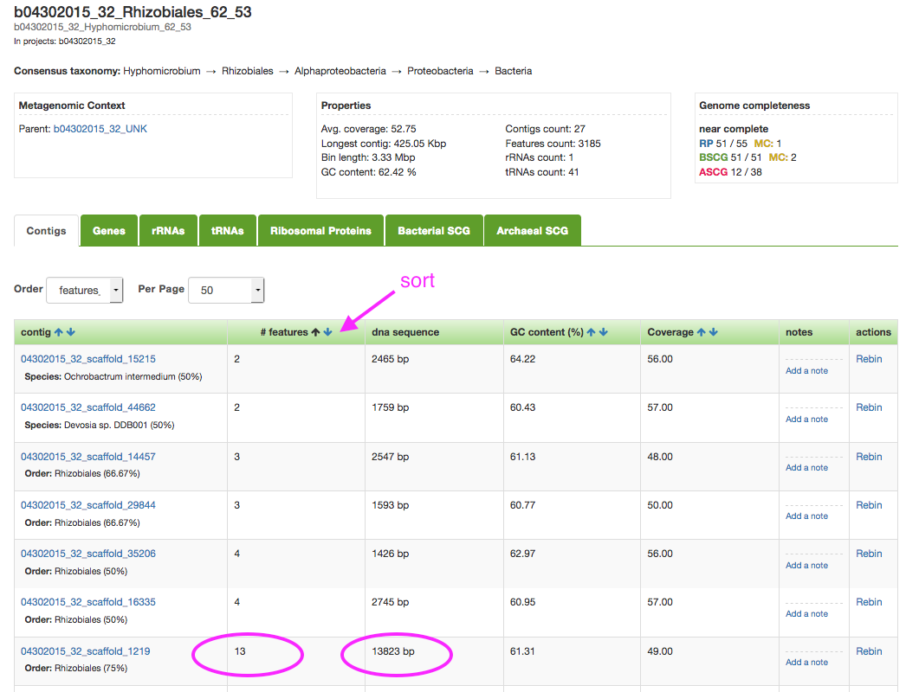
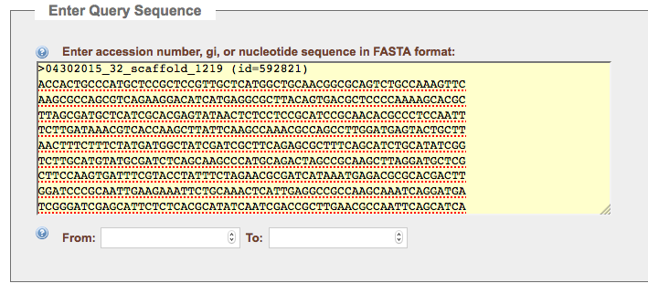
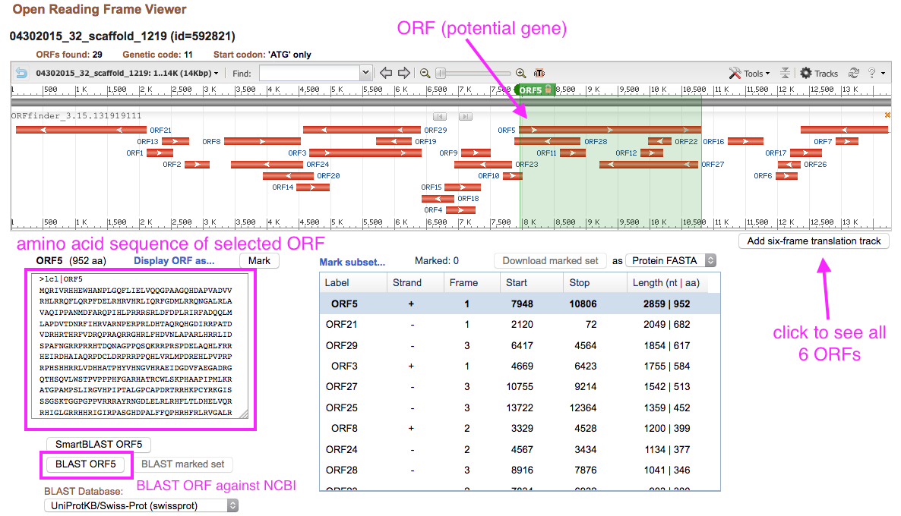
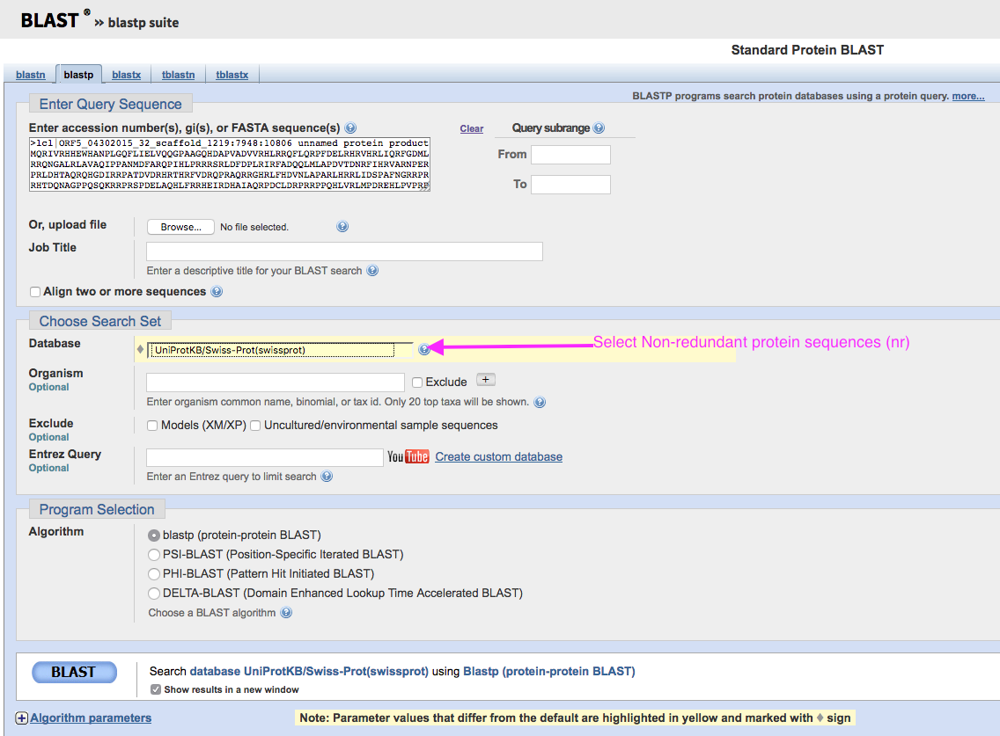

# Welcome to metagenomics data analysis lab week 8: Friday the 13th quarantine edition!

Hello everyone and welcome! This week's lab is going to be utilizing online resources, and will be structured a bit differently. Since we can't meet in person and we can't work in groups in the same way, you have the option of completing everything here now or spreading out your work during the week. Don't feel pressured, especially if you run into technical issues, to get this all done at once. 

And definitely don't stress if you encounter problems or obstacles. You can reach me on the slack workspace I created for the lab, which I sent out a link for on bCourses- I don't want to put that link on a publicly available webpage, so go ahead and go over there if you haven't already joined. That's the best way to get a quick response from me if you need my help.

This week's lab is going to be a demonstration/instruction of how to go about investigating interesting proteins you find in metagenomic data. Today we're going to focus exclusively on proteins you can find in your bins, since those are more interesting (you know, relatively, which organism they came from).

In our lab, we use several popular tools to look at interesting proteins, which each have their own advantages and disadvantages. Let's talk about them, and what they're each good at.

## Goals for today:

- Predict genes, ORFs using Prodigal
- Learn how to use BLASTp/BLASTn (your choice)
- Learn how to use Interpro and HMMscan
- Start playing with KEGG and investigating the metabolic pathways your proteins are part of

---

## Tools to investigate proteins of interest:

- Interproscan (most thorough)

<a href="https://www.ebi.ac.uk/interpro/search/sequence/">https://www.ebi.ac.uk/interpro/search/sequence/</a>

This option is the best if you have a protein that's really unusual and you want to find out exactly what it is. Interproscan uses a large suite of HMMs (probabilistic models that we won't go over in detail today) to give you a wealth of information about the protein sequence you provide. 

- Blastp (alignment-based)

<a href="https://blast.ncbi.nlm.nih.gov/Blast.cgi?PAGE=Proteins">https://blast.ncbi.nlm.nih.gov/Blast.cgi?PAGE=Proteins</a>

BLASTp draws on the strength of the NCBI's public sequence database, as well as a great list of structural models that help you see the domain-level features of your protein sequence, which can tell you a lot about its function.

- HMMscan (HMM-based, very fast)

<a href="https://www.ebi.ac.uk/Tools/hmmer/search/hmmscan">https://www.ebi.ac.uk/Tools/hmmer/search/hmmscan</a>

HMMscan allows you to search against a suite of domain-level HMMs, which can tell you a lot about what your protein does, and how it functions. Its companion program, pHMMer, gives you similar results along with a list of similar sequences from the EMBL-EBI's public database, although this approach yields many fewer hits than running BLASTp and I would recommend using BLAST instead of pHMMer unless you're pressed for time. It's really fast, though, and if you're doing tons of these searches, as I often am in the course of my research, it can be a real time saver.

---

# Choosing a sequence to work with

Go ahead and go over to <a href="class.ggkbase.berkeley.edu">class.ggkbase.berkeley.edu</a> and log in. Select one of your organisms, and click on it to get a list of the scaffolds in that bin. Select a relatively large scaffold (more than ~10kbp) and click on it. A good way to do this is to sort the sequences by '# features' and find a scaffold with more than 10 genes.

Click on the link to this contig and download the DNA sequence for this contig.  Open the fasta file in a plain text editor; select all (cmd+a on Mac or ctrl+a on Windows/Linux), and copy the sequence.  Go to NCBI ORF finder (<a href="https://www.ncbi.nlm.nih.gov/orffinder">https://www.ncbi.nlm.nih.gov/orffinder</a>) and paste the sequence into the Query box.

You can use the standard genetic code (1), but may want to consider alternative codes, such as Bacterial, Archaeal, and Plant Plasmid (11).  A reasonable minimum ORF length is 300, but feel free to try other cutoffs.  Hit the submit button to see your potential ORFs.

The results show all of the possible genes in all reading frames.  You can click on a gene in the viewer or in the list to get its particular sequence. Note: this is ALL of the possibilities across multiple reading frames, some of the resulting proteins are likely not real proteins. 

Verify that your selected protein is real by clicking on it, like in the image below, scrolling down to the bottom left of the page and selecting "BLAST". If your results show a bunch of other proteins with high sequence identity and defined function, congratulations! You got a nice protein. Keep working with it. Otherwise, find another one, rinse and repeat. The best candidates will have relatively little overlap with other predicted ORFs. All the standard parameters are just fine, so don't worry about changing anything once you see the page shown in the image below- just scroll down and click BLAST.

How well do the results cover your query?  Look at the colored bars in the top box to visualize this.  Do you get results in the description box that agree on what this protein might be?  Do the results have a functional annotation (some kind of specific protein) or does it simply say “hypothetical protein” or “unknown”?

---

# Interpro

Now that you have a good ORF that you can trust is real, go ahead and navigate over to Interproscan (<a href="https://www.ebi.ac.uk/interpro/search/sequence/">https://www.ebi.ac.uk/interpro/search/sequence/</a>). Paste this amino acid sequence in as your query and wait for a little while - interpro takes a bit of time, but the results are really good and trustworthy.

You'll get some cool results from interpro which are really interactive and highly detailed, if you have a real protein. If you have a protein with unknown function or that doesn't look like any well-characterized proteins, you might not. In that case, just go back to NCBI ORF finder and pick another protein and repeat this whole process. (If you've closed the window with NCBI ORF finder or just don't like it, you can always get these proteins from class.ggkbase pretty easily too.)

Below is a run down of the kinds of information interpro will display for you:

---

 

Protein family: in InterPro a protein family is a group of proteins that share a common evolutionary origin, reflected by their related functions and similarities in sequence or structure.  (The inclusion of protein structure is one of the differences between the general search in NCBI, that only considered sequence homology, and this search against InterPro)

Protein domain: distinct functional and/or structural units in a protein.  Usually they are responsible for particular functions or interaction, contributing to the overall role of a protein.  Domains may exist in a variety of biological contexts, where similar domains can be found in proteins with different functions.  

Repeats are typically short amino acid sequences that are repeated within a protein, and may confer binding or structural properties upon it.  

Sites: groups of amino acids that confer certain characteristics upon a protein, and may be important for its overall function.  Sites are usually rather small (only a few amino acids long).  Some types of sites in InterPro are active sites (involved in catalytic activity, binding sites (bind molecules or ions), post-translational modification sites (chemically modified after the protein is translated), and conserved sites (found in specific types of proteins, but whose function is unknown) 

---

# Last module: Looking things up in KEGG

Now that you have a wealth of information about the structure and predicted information of your protein, go ahead and look it up in KEGG (<a href="http://www.genome.jp/kegg/pathway.html">http://www.genome.jp/kegg/pathway.html</a>). There are lots of different features in KEGG, which I'll go over in more detail in the video I'll post along with today's lab materials, so go look it up there if you're curious. Otherwise, feel free to explore.

# Optional final task: Operon finding

There are multiple ways to find operons in your data. One of the most straightforward is to look through the functional annotations on class.ggkbase.berkeley.edu for your organism by navigating to that organism's page, then clicking on a particular scaffold (remember to choose one with lots of features!). Remember, you're looking for lots of genes clustered closely together and which have similar functionality. Look for some, and if you find a nice operon let me know on Slack!
