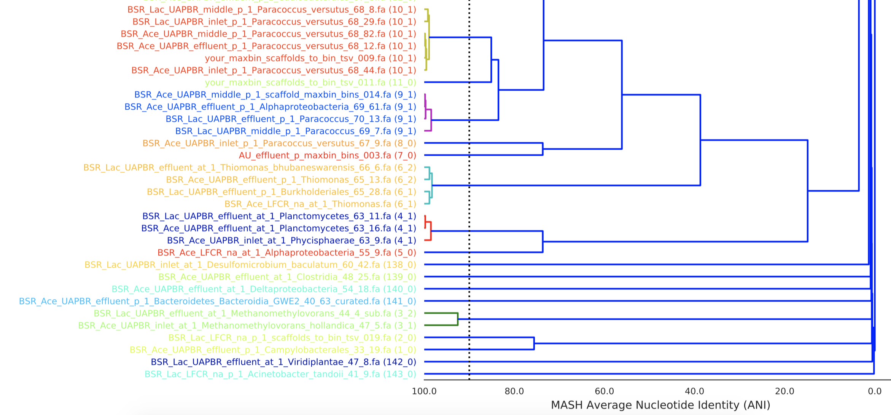

# Hello again and welcome to Metagenomics Data Analysis Lab, Week 9!

This week we're going to be looking at methods of dereplication of metagenomic bins. We often sequence environments that contain lots of very similar microorganisms (E. faecalis, anyone?) and it becomes less than desirable to spend time and effort analyzing a bunch of extremely closely related genomes instead of looking at the general population.

For this and other reasons, which I'll discuss in much more detail in today's lecture/demo video, we use a program called dRep (https://github.com/MrOlm/drep) designed by the inimitable Dr. Matt Olm, a former ESPM 112L GSI and Ph.D. student in the Banfield lab.

## Make sure to watch the lab lecture/demo video before doing this! Don't proceed unless you have done that!

Today's lab will involve multiple optional steps, which I encourage you to look into. dRep has a number of functionalities that we're not going to be using here because of computational/time constraints, but if we don't have everyone running the programs at the same time on the cluster, everyone can have a chance to run dRep.

First, let's go over dRep, how I ran it, and how you can run it (on your own time if you so desire, not during the lab period please!).

dRep is a program that utilizes genome wide average nucleotide identity (ANI) to group bins into clusters based on how similar they are. In this way, we can figure out which organisms are present across multiple samples because the bin from each sample will fall into the same ANI cluster.

If you want to run dRep on your own, the documentation is here: 

I highly recommend looking through this anyway regardless of whether or not you plan to run dRep on your own. You'll get a great idea of all the functionality in dRep, straight from the source.

Now the next section is optional, and for your reference later. dRep is great and worth using, but we can't have all of you run it all at once, so please just read it and come back to it later. Skip to the next section - I've already run dRep for you, and you can go ahead and look at the output and analyze it.

---
### Instructions on how to run dRep 

Now remember, don't go running dRep immediately during the lab time, but if you're curious, here's how to do it.

In order to run dRep, you need each bin from each sample as a separate fasta file (where each file contains the nucleotide sequences belonging to that bin). I’ve generated these files for you this week. They’re located here:
`/class_data/baby_bins/`.

HOWEVER, none of you have write permissions to this directory, so dRep has a hard time running. (I can go into detail as to why later if you're curious.) If you're going to run dRep on your own, which again, you shouldn't do during lab time, you'll need to copy the fasta files into a directory in your personal home directory.
In order to do this, copy everything from `/class_data/baby_bins` into a folder in your own directory, like so:

```
mkdir ~/baby_bins

cp /class_data/baby_bins/*.fasta ~/baby_bins/
```

dRep requires an output directory and to be told where the bin fasta files are. Use the following command replacing your.output.directory with an output name of your choosing:

`dRep compare ~/dRep_output -g ~/baby_bins/*.fasta -p 2`

The `-p 2` option limits you to 2 processors. If no one else is online you can use more (don't use more than 8). But check with me first before you do this! I'll be on slack pretty much all the time. Don't use more than 2 threads without clearing it with me first.

---

# Analyzing dRep output

Now you can go in and look at what dRep has generated after comparing all of the bins from all 9 of our samples. Go ahead and navigate to `/class_data/dRep_output` and take a look. The `dereplicated_genomes/` folder contains the genomes dRep has chosen as representatives- i.e. the best genome for each group. The `figures/` folder has all the pictures you'll need to look at in the following section. Remember, to download any of these pictures, here's what to do:

Use `realpath` to find the full path to the file you want to download:

```realpath Primary_clustering_dendrogram.pdf```

Then copy the path this prints out (ex. `/class_data/dRep_output/figures/Primary_clustering_dendrogram.pdf`). 

Mac/Linux: open a terminal window/tab on your computer and enter the following:

`scp [YOUR STUDENT ID]@class.ggkbase.berkeley.edu:/class_data/dRep_output/figures/Primary_clustering_dendrogram.pdf .`

Windows users: Grab it off of WinSCP or PuTTY or whatever it is that you use. 

### Now that you know how to download things:

Download the files `Primary_clustering_dendrogram.pdf` and `Secondary_clustering_dendrograms.pdf`. Let's take a look at them.

The primary clustering dendrogram is a clustering of the bins based off of MASH. It should look something like the following and have every bin from every sample in a single dendrogram:



MASH clustering is a very fast form of clustering that estimates ANI but is not as accurate as true ANI. dRep uses MASH clustering to find initial clusters of pretty similar bins (sharing 90% or greater estimated ANI) on which it can then perform the more computationally expensive true ANI clustering. 

The secondary clustering dendrogram is the ANI clustering performed on each of the identified MASH clusters. This file should contain quite a few different dendrograms, each relating to a different MASH cluster and should look something like the following for a single cluster:


We generally consider bins that share 99% or greater ANI to be from very closely related organisms. In the above secondary clustering example, all of those bins would be considered to be from the same set of closely related organisms. In the below example, there are bins from two different organisms present:


